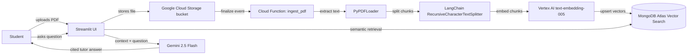

# Architecture

Draft architecture for the first working version.

## Flow We Need To Prove

1. The user uploads a PDF through Streamlit or directly into the GCS bucket.
2. GCS emits a finalize event when the object is written.
3. The Cloud Function downloads the PDF and extracts text.
4. The text is split into chunks with source metadata.
5. Vertex AI creates embeddings for the chunks.
6. MongoDB Atlas stores the text, metadata, and vectors.
7. The chat page retrieves the closest chunks for a question.
8. Gemini answers from those chunks and cites the file/page.

## Rubric Checks

- Cloud automation: GCS finalize event triggers ingestion.
- Retrieval accuracy: answers cite the uploaded notes.
- Architecture: ingestion and chat are separate enough to explain.
- Tutor persona: the prompt should force a formal teaching style.
- Advanced feature: Streamlit upload/chat UI.
